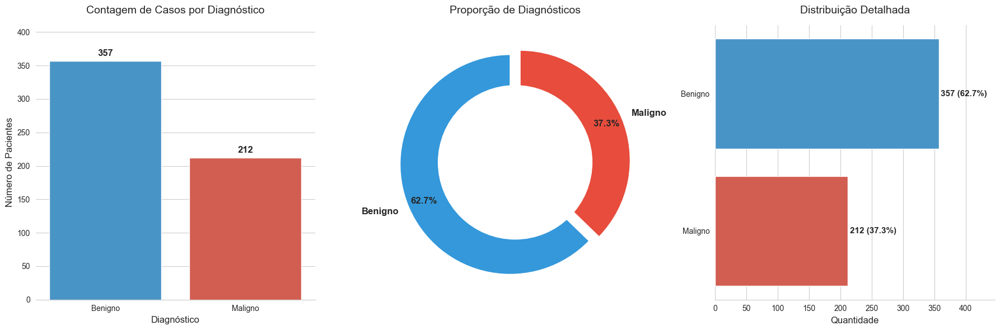
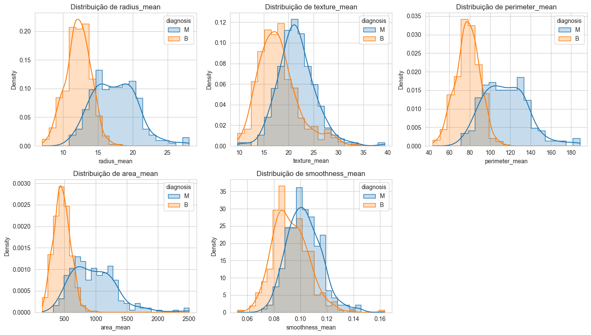
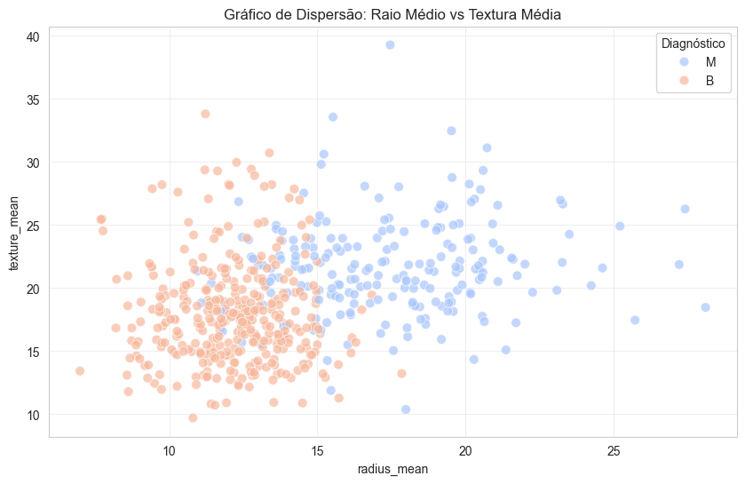
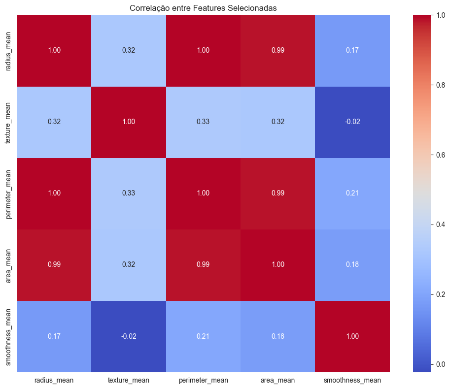
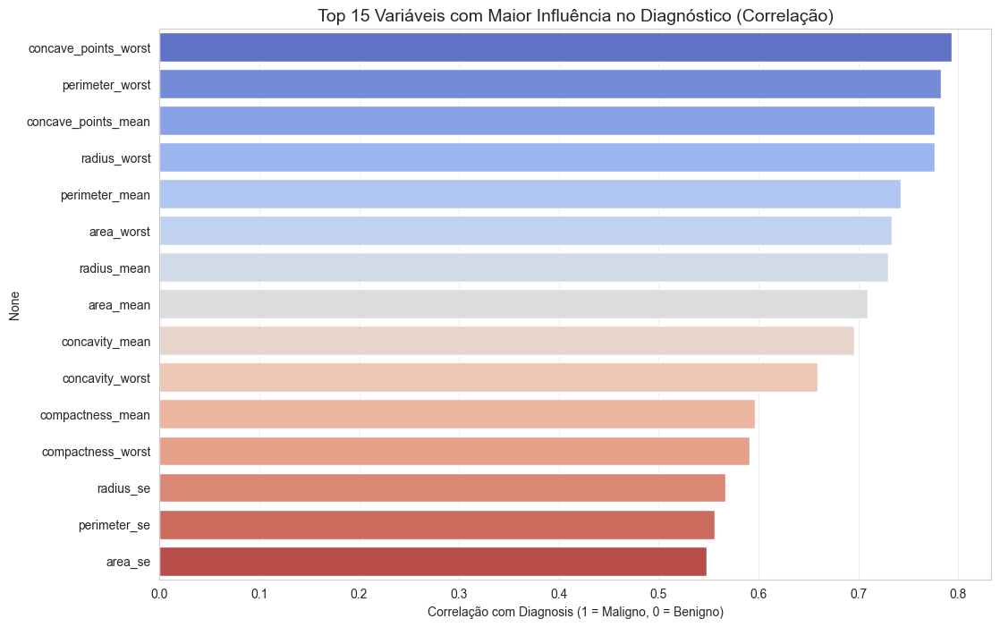
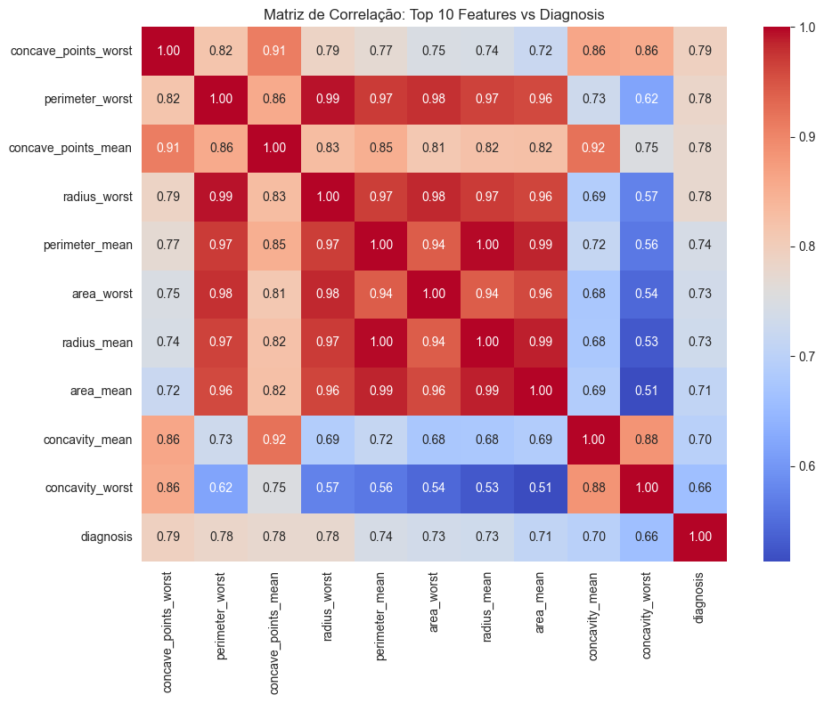
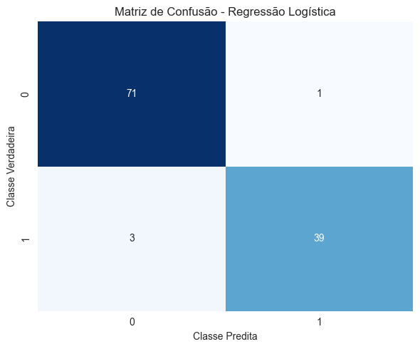
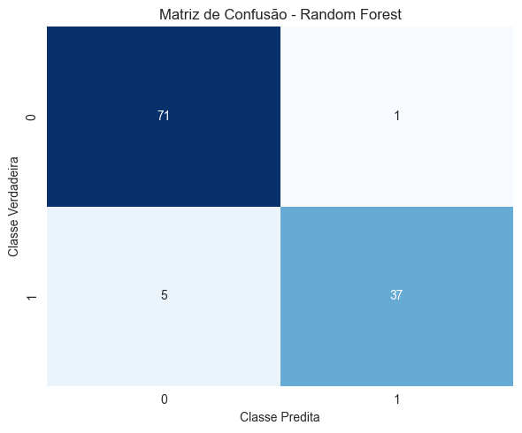
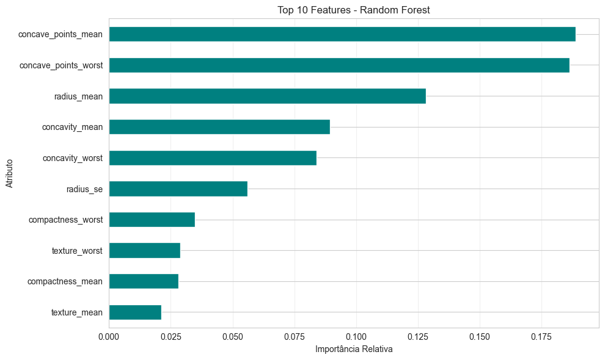

<link rel="stylesheet" href="{{ '/assets/css/custom.css' | relative_url }}">

<div class="hero-section">
  <h1>🎗️ Breast Cancer Diagnosis Pipeline</h1>
  <p class="subtitle">End-to-end machine learning classification using Wisconsin WDBC dataset</p>
  
  <div class="badges">
    
    
    
    
  </div>
</div>

---

## ✨ Project Highlights

<div class="highlights-grid">
  <div class="highlight-card">
    <h3>📊 Dataset</h3>
    <p>569 samples with 30 numeric features extracted from cell nuclei images</p>
  </div>
  
  <div class="highlight-card">
    <h3>🎯 Best Model</h3>
    <p><strong>96.5%</strong> accuracy with Logistic Regression</p>
  </div>
  
  <div class="highlight-card">
    <h3>🔬 Features</h3>
    <p>Reduced from <strong>30 → 23</strong> by removing correlated predictors</p>
  </div>
  
  <div class="highlight-card">
    <h3>⚡ Precision</h3>
    <p><strong>97.5%</strong> precision for malignant class detection</p>
  </div>
</div>

---

## 🧠 Problem Context

Breast cancer is one of the most common causes of mortality among women worldwide. **Early detection significantly improves treatment outcomes.**

This project uses supervised machine learning to learn patterns that separate **malignant** from **benign** tumors using nucleus-level morphological features extracted from digitized Fine Needle Aspiration (FNA) images.

---

## 🔬 Methodology

<div class="pipeline-steps">
  <div class="step">
    <span class="step-number">1</span>
    <div class="step-content">
      <h4>Data Loading</h4>
      <p>WDBC dataset from UCI ML Repository</p>
    </div>
  </div>
  
  <div class="step">
    <span class="step-number">2</span>
    <div class="step-content">
      <h4>EDA & Validation</h4>
      <p>Descriptive statistics, class distribution, data quality checks</p>
    </div>
  </div>
  
  <div class="step">
    <span class="step-number">3</span>
    <div class="step-content">
      <h4>Preprocessing</h4>
      <p>Feature naming standardization (mean/se/worst)</p>
    </div>
  </div>
  
  <div class="step">
    <span class="step-number">4</span>
    <div class="step-content">
      <h4>Feature Selection</h4>
      <p>Removed highly correlated features (>0.95)</p>
    </div>
  </div>
  
  <div class="step">
    <span class="step-number">5</span>
    <div class="step-content">
      <h4>Model Training</h4>
      <p>Logistic Regression & Random Forest with StandardScaler</p>
    </div>
  </div>
  
  <div class="step">
    <span class="step-number">6</span>
    <div class="step-content">
      <h4>Evaluation</h4>
      <p>Metrics, confusion matrix, feature importance</p>
    </div>
  </div>
</div>

---

## 📊 Results

### Model Performance (Test Set)

<div class="results-table">
  <table>
    <thead>
      <tr>
        <th>Model</th>
        <th>Accuracy</th>
        <th>Precision</th>
        <th>Recall</th>
        <th>F1-Score</th>
      </tr>
    </thead>
    <tbody>
      <tr class="best-model">
        <td><strong>Logistic Regression</strong></td>
        <td><strong>96.5%</strong></td>
        <td><strong>97.5%</strong></td>
        <td><strong>92.9%</strong></td>
        <td><strong>95.1%</strong></td>
      </tr>
      <tr>
        <td>Random Forest</td>
        <td>94.7%</td>
        <td>97.4%</td>
        <td>88.1%</td>
        <td>92.5%</td>
      </tr>
    </tbody>
  </table>
</div>

<div class="insight-box">
  <h4>💡 Why Recall Matters</h4>
  <p>In medical screening, higher recall for the malignant class helps reduce <strong>false negatives</strong> (malignant tumors predicted as benign), which is critical for patient safety.</p>
</div>

---

## 🔍 Key Findings

### Top Predictive Features

The most important features identified through feature importance analysis:

1. **Concave points** (mean & worst) - Strong indicator of malignancy
2. **Radius** measurements - Size-related characteristics
3. **Concavity** metrics - Shape irregularities

These features align with known morphological differences between malignant and benign cell nuclei.

---

## 📊 Visualizations

### Data Distribution

<div class="viz-container">
  
  <p class="viz-caption"><strong>Figure 1:</strong> Distribution of benign (62.7%) vs. malignant (37.3%) cases in the WDBC dataset</p>
</div>

### Feature Analysis

<div class="viz-grid">
  <div class="viz-item">
    
    <p class="viz-caption"><strong>Figure 2:</strong> Distribution of key features by diagnosis</p>
  </div>
  
  <div class="viz-item">
    
    <p class="viz-caption"><strong>Figure 3:</strong> Correlation matrix showing feature relationships</p>
  </div>
</div>

### Feature Importance & Selection

<div class="viz-grid">
  <div class="viz-item">
    
    <p class="viz-caption"><strong>Figure 4:</strong> Top 15 features most correlated with malignancy</p>
  </div>
  
  <div class="viz-item">
    
    <p class="viz-caption"><strong>Figure 5:</strong> Correlation heatmap of top 10 predictive features</p>
  </div>
</div>

### Model Performance

<div class="viz-grid">
  <div class="viz-item">
    
    <p class="viz-caption"><strong>Figure 6:</strong> Confusion Matrix - Logistic Regression (96.5% accuracy)</p>
  </div>
  
  <div class="viz-item">
    
    <p class="viz-caption"><strong>Figure 7:</strong> Confusion Matrix - Random Forest (94.7% accuracy)</p>
  </div>
</div>

### Feature Importance Analysis

<div class="viz-grid">
  <div class="viz-item">
    
    <p class="viz-caption"><strong>Figure 8:</strong> Top 10 features by importance (Random Forest)</p>
  </div>
  
  <div class="viz-item">
    
    <p class="viz-caption"><strong>Figure 9:</strong> Top 10 features by coefficient magnitude (Logistic Regression)</p>
  </div>
</div>

---

## 🚀 Quick Start

### Installation

```bash
# Clone the repository
git clone https://github.com/Taimisson/breast-cancer-wdbc-ml.git
cd breast-cancer-wdbc-ml

# Install dependencies
pip install -r requirements.txt

# Run the notebook
jupyter notebook notebooks/projeto_cancer_mama.ipynb
```

### Requirements

- Python 3.8+
- pandas, numpy, matplotlib, seaborn
- scikit-learn
- ucimlrepo

---

## 📁 Project Structure

```
.
├── README.md                         # Project documentation
├── requirements.txt                  # Python dependencies
├── LICENSE                          # MIT License
├── CITATION.cff                     # Citation information
├── notebooks/
│   └── projeto_cancer_mama.ipynb   # Main analysis notebook
└── docs/
    ├── index.md                     # GitHub Pages homepage
    ├── notebook.html                # Exported notebook
    └── assets/
        ├── css/                     # Custom styles
        └── img/                     # Visualizations
```

---

## 🔗 Links

<div class="links-section">
  <a href="https://github.com/Taimisson/breast-cancer-wdbc-ml" class="button primary">
    <span>📦</span> View Repository
  </a>
  <a href="notebook.html" class="button secondary">
    <span>📓</span> Full Notebook
  </a>
  <a href="https://www.datacamp.com/datalab/w/54ce12ff-34cb-46b5-b1b9-dc2715b9a821/edit" class="button secondary">
    <span>💻</span> Interactive Version
  </a>
</div>

---

## 📄 License & Citation

This project is licensed under the **MIT License**. See [LICENSE](../LICENSE) for details.

If you use this project in your research or work, please cite:

```bibtex
@software{breast_cancer_wdbc_ml,
  author = {Taimisson},
  title = {Breast Cancer Diagnosis ML Pipeline},
  year = {2026},
  url = {https://github.com/Taimisson/breast-cancer-wdbc-ml}
}
```

---

<div class="footer-section">
  <p>Built with ❤️ using Python, scikit-learn, and Jupyter</p>
  <p><small>Dataset: Wisconsin Diagnostic Breast Cancer (WDBC) - UCI Machine Learning Repository</small></p>
</div>
